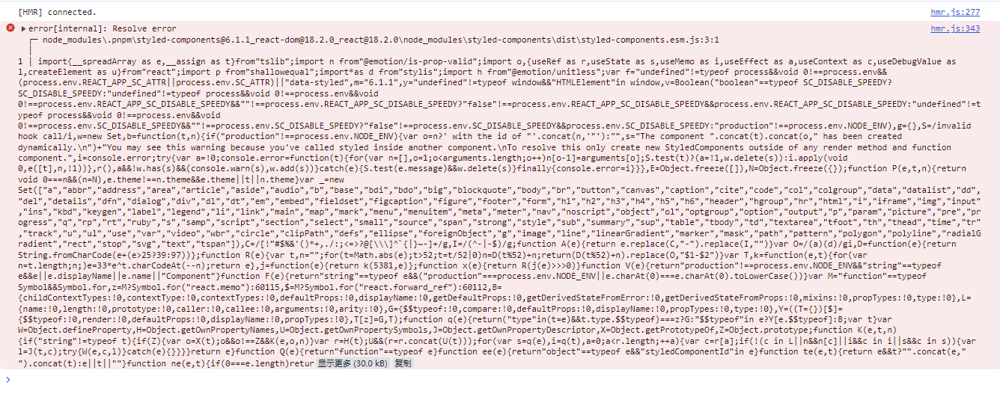

# Rsbuild Project

## pnpm 无法运行



Install the dependencies:

```bash
pnpm install
```

Start the dev server:

```bash
pnpm dev
```

Build the app for production:

```bash
pnpm build
```

Preview the production build locally:

```bash
pnpm preview
```

## npm 可以运行

Install the dependencies:

```bash
npm install
```

Start the dev server:

```bash
npm dev
```

Build the app for production:

```bash
npm build
```

Preview the production build locally:

```bash
npm preview
```
